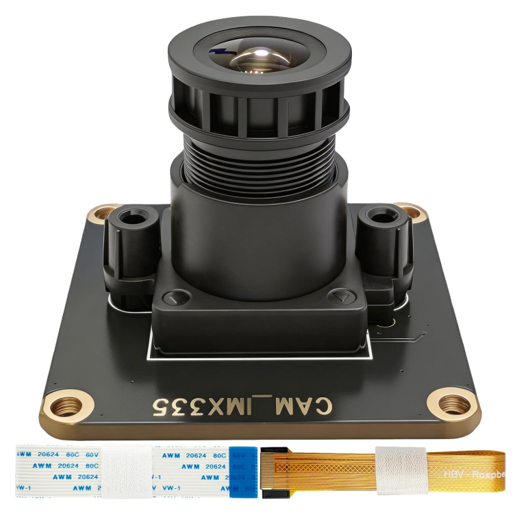

# CAM-IMX335-5MP



The **CAM-IMX335-5MP** is a high-performance 5-Megapixel camera module designed for Raspberry Pi, featuring the Sony IMX335 image sensor. This repository provides the necessary drivers, Image Processing Algorithm (IPA) modules, and installation scripts to enable full support for the IMX335 sensor on Raspberry Pi 4 and Raspberry Pi 5 platforms.

## Features

- **Sensor**: Sony IMX335 5MP CMOS Image Sensor
- **Compatibility**: Fully compatible with Raspberry Pi 4 and Raspberry Pi 5
- **Software Support**: Integrates with the official `libcamera` stack and `rpicam-apps`
- **Installation**: Provides both online and offline installation methods

## Repository Contents

- `CAM-IMX335-5MP UserManual.pdf`: Comprehensive user manual with detailed hardware specifications and software setup instructions.
- `build_online_complete.tar.gz`: Package for online installation (compiles from source).
- `build_offline_complete.tar.gz`: Package for offline installation (pre-compiled binaries).
- `ipa_rpi_pisp.so` / `ipa_rpi_pisp.so.sign`: Pre-compiled IPA module for Raspberry Pi 5.
- `ipa_rpi_vc4.so` / `ipa_rpi_vc4.so.sign`: Pre-compiled IPA module for Raspberry Pi 4.
- `replace_ipa.sh`: Automated script to detect the Raspberry Pi model and install the correct IPA module.

## Quick Start

### 1. Hardware Connection

Connect the CAM-IMX335-5MP module to the MIPI CSI camera port on your Raspberry Pi using the provided ribbon cable. Ensure the contacts are facing the correct direction according to your Raspberry Pi model.

### 2. Software Installation

You can choose either the quick IPA replacement method or the full installation method.

#### Method A: Quick IPA Replacement (Recommended)

If you already have a working `libcamera` environment, you can simply replace the IPA module using the provided script:

```bash
git clone https://github.com/INNO-MAKER/CAM-IMX335-5MP.git
cd CAM-IMX335-5MP
sudo chmod +x replace_ipa.sh
sudo ./replace_ipa.sh
```

The script will automatically detect whether you are using a Raspberry Pi 4 or Pi 5 and install the corresponding `.so` file (`ipa_rpi_vc4.so` or `ipa_rpi_pisp.so`).

#### Method B: Full Installation

For a complete installation from scratch, please refer to the `CAM-IMX335-5MP UserManual.pdf` included in this repository. You can use either the online or offline build packages provided.

### 3. Testing the Camera

After installation and rebooting, you can test the camera using the standard `rpicam-apps`:

```bash
# List available cameras to verify detection
rpicam-hello --list-cameras

# Open a preview window
rpicam-hello -t 0

# Capture a JPEG image
rpicam-still -o test.jpg
```

## Documentation

For detailed specifications, advanced configuration, and troubleshooting, please consult the [CAM-IMX335-5MP UserManual.pdf](./CAM-IMX335-5MP%20UserManual.pdf).

## License

Please refer to the individual source files and packages for licensing information. The `libcamera` components are subject to their respective open-source licenses.
