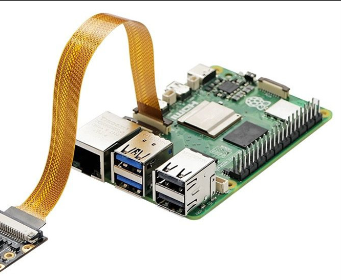

# CAM-IMX335-5MP


The **CAM-IMX335-5MP** is a high-performance 5-Megapixel camera module designed for Raspberry Pi, featuring the Sony IMX335 image sensor. This repository provides the necessary drivers, Image Processing Algorithm (IPA) modules, and installation scripts to enable full support for the IMX335 sensor on Raspberry Pi 4 and Raspberry Pi 5 platforms.

## Features

- **Sensor**: Sony IMX335 5MP CMOS Image Sensor
- **Compatibility**: Fully compatible with Raspberry Pi 4 and Raspberry Pi 5
- **Software Support**: Integrates with the official `libcamera` stack and `rpicam-apps`
- **Installation**: Provides pre-compiled IPA, offline, and online installation methods

## Repository Contents

| File / Folder | Description |
| :--- | :--- |
| `precompiler/` | Pre-compiled IPA modules for specific OS versions (fastest setup) |
| `build_offline_complete.tar.gz` | Offline build package (libcamera + rpicam-apps source) |
| `build_online_complete.tar.gz` | Online build script |
| `CAM-IMX335-5MP.pdf` | Comprehensive user manual |
| `images/` | Product images |

## Quick Start

### 1. Hardware Connection

Connect the CAM-IMX335-5MP module to the MIPI CSI camera port on your Raspberry Pi using the provided FPC ribbon cable. Ensure the contacts are facing the correct direction according to your Raspberry Pi model.



### 2. Software Installation

Three installation methods are available. **Option A is recommended** for the fastest setup.

---

#### Option A: Pre-compiled IPA Installation (Recommended)

> **Important Notice**: Pre-compiled IPA packages are built for **specific OS versions and kernel versions**. Before installation, please verify that your system matches exactly. If your OS version is not listed below, use **Option B or C** instead.

**Supported Versions:**

| Package | OS | Platform | Date |
| :--- | :--- | :--- | :--- |
| `imx335_ipaonly_trixie_pi5_20260509-171204.tar.gz` | Raspberry Pi OS Trixie | Pi 5 | 2026-05-09 |

**Check your system version before installation:**
```bash
# Check OS version
cat /etc/os-release

# Check kernel version
uname -r
```

**Installation:**
```bash
# Clone the repository
git clone https://github.com/INNO-MAKER/CAM-IMX335-5MP.git
cd CAM-IMX335-5MP

# Extract the matching pre-compiled IPA package
tar -xzf precompiler/imx335_ipaonly_trixie_pi5_20260509-171204.tar.gz

# Run the installation script
chmod +x install.sh
sudo ./install.sh
```

> **Note**: More pre-compiled packages for additional OS versions will be added as testing is completed. If your OS version is not listed, please use Option B (offline compilation).

---

#### Option B: Offline Compilation (Source Build)

> Use this option if your OS/kernel version is not listed in the pre-compiled packages above.

1. Update system packages:
   ```bash
   sudo apt-get update
   sudo apt-get dist-upgrade
   ```

2. Clone the repository:
   ```bash
   git clone https://github.com/INNO-MAKER/CAM-IMX335-5MP.git
   cd CAM-IMX335-5MP
   ```

3. Set permissions and extract the offline build package:
   ```bash
   sudo chmod -R a+rwx *
   sudo tar -zxvf build_offline_complete.tar.gz
   cd build_offline_complete
   ```

4. Run the build and installation script:
   ```bash
   sudo ./build_offline_complete_trixie.sh
   ```

> **Build Time**: The script will compile libcamera with IMX335 IPA support and install rpicam-apps. This may take 30-60 minutes depending on your hardware.

---

#### Option C: Online Compilation

For users with a stable internet connection who prefer to build from the latest sources:

```bash
git clone https://github.com/INNO-MAKER/CAM-IMX335-5MP.git
cd CAM-IMX335-5MP
sudo tar -zxvf build_online_complete.tar.gz
cd build_online_complete
sudo ./build.sh
```

### 3. Camera Configuration

Edit your `/boot/firmware/config.txt` (Pi 5) or `/boot/config.txt` (Pi 4) and add one of the following configurations:

**Default (CSI1 port)**:
```ini
camera_auto_detect=0
dtoverlay=imx335
```

**Use CSI0 port**:
```ini
camera_auto_detect=0
dtoverlay=imx335,cam0
```

**Use CSI1 port (explicit)**:
```ini
camera_auto_detect=0
dtoverlay=imx335,cam1
```

Reboot your Raspberry Pi for the changes to take effect:
```bash
sudo reboot
```

### 4. Testing the Camera

After installation and rebooting, you can test the camera using the standard `rpicam-apps`:

`````bash
# List available cameras to verify detection
rpicam-hello --list-cameras

# Open a preview window
rpicam-hello -t 0

# Capture a JPEG image
rpicam-still -o test.jpg

# Record a video
rpicam-vid -t 5000 -o test.h264
```

---

## Preset OS Image

A pre-configured Raspberry Pi OS image with all drivers and software pre-installed is available for download:

**Download**: [https://www.jianguoyun.com/p/DWqJpGAQpdSrBxil9p8GIAA](https://www.jianguoyun.com/p/DWqJpGAQpdSrBxil9p8GIAA)  
**Password**: `exgk55`

---

## Documentation

For detailed specifications, advanced configuration, and troubleshooting, please consult the [CAM-IMX335-5MP.pdf](./CAM-IMX335-5MP.pdf).
